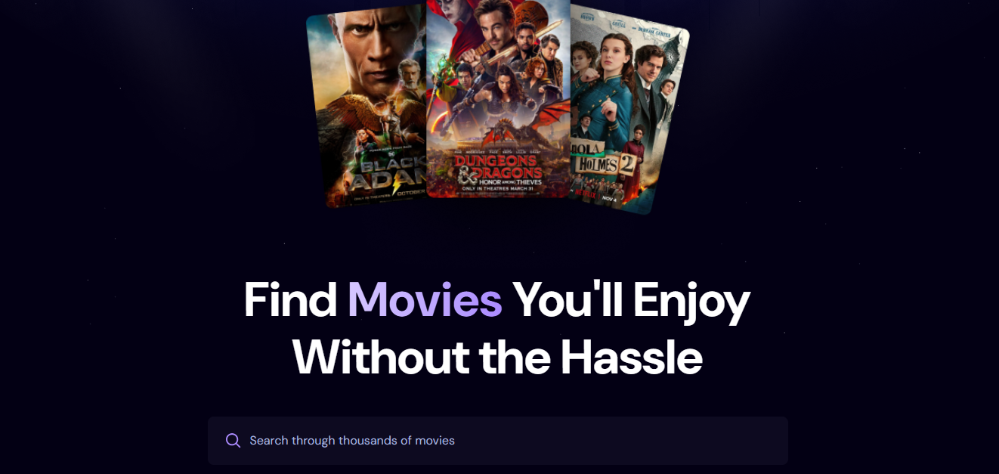
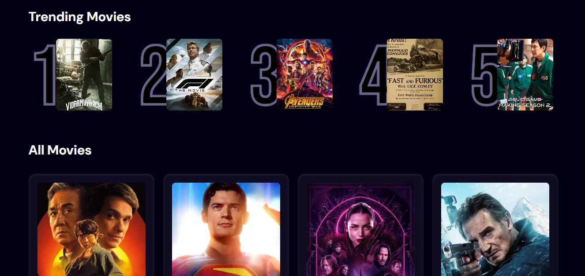

# 🎬 Movie Explorer App

A clean, responsive React app to **search, discover, and explore trending movies**, built with **TMDB API** and styled using Tailwind CSS. This project was created to practice **React basics**, API calls, and component-based architecture.


## 🔍 Features

- 🔎 **Search Movies** by title using TMDB API
- 🎯 **Trending Carousel** of most popular movies (based on user interaction)
- ⭐ View **movie ratings, release year, language**, and posters
- 📡 **Debounced search** to limit unnecessary API calls
- 🔄 Loading spinner for a smooth user experience
- 💾 Records popular movie searches (via Appwrite backend)

## ⚙️ Tech Stack

| Frontend       | API                          | Backend                             |
|----------------|------------------------------|-------------------------------------|
| React.js       | [TMDB API](https://www.themoviedb.org/documentation/api) | Appwrite (for trending movie storage) |
| Tailwind CSS   | Fetch API                    | Custom `updateSearchCount()` & `getTrendingMovies()` logic |

## 🚀 Getting Started

### 1. Clone the Repository

```bash
git clone https://github.com/your-username/movie-explorer-app.git
cd movie-explorer-app
```

### 2. Install Dependencies

```bash
npm install
```

### 3. Setup Environment Variables

Create a `.env` file in the root and add your TMDB API key:

```env
VITE_TMDB_API_KEY=your_tmdb_bearer_token_here
```

⚠️ The TMDB API key used here is a Bearer Token, not the regular v3 API key.

### 4. Run the Development Server

```bash
npm run dev
```

## 🧩 Project Structure

```bash
src/
├── App.jsx               # Main component
├── appwrite.js           # Backend logic (search count, trending)
├── components/
│   ├── MovieCard.jsx     # Movie display component
│   ├── Search.jsx        # Search bar component
│   └── Spinner.jsx       # Loading spinner
├── assets/               # Static assets like icons/images
```

## 📸 Screenshots

| Search Page | Trending Section |
|-------------|------------------|
|  |  |

## 📈 Future Improvements

- Add pagination or infinite scroll
- Implement genre-based filters
- Add user login + personal watchlist
- Responsive design enhancements
- Replace Appwrite with a scalable backend or local storage fallback

## 🧠 Learnings

This app helped understand the following concepts in practice:

- ✅ Functional components and `useState`, `useEffect` hooks
- ✅ Using custom hooks like `useDebounce` from `react-use`
- ✅ Clean component architecture and props drilling
- ✅ API integration and async data fetching
- ✅ Basic Appwrite backend integration

## 📮 Feedback & Contributions

Feel free to fork this repo, suggest features, or raise issues. PRs are welcome too! 😊

## 📄 License

This project is licensed under the MIT License.

## 🙋‍♂️ Author

Made with ❤️ by Dhanush Mohan
